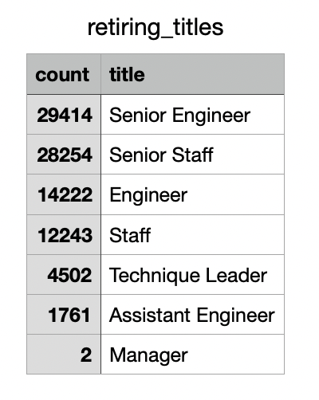
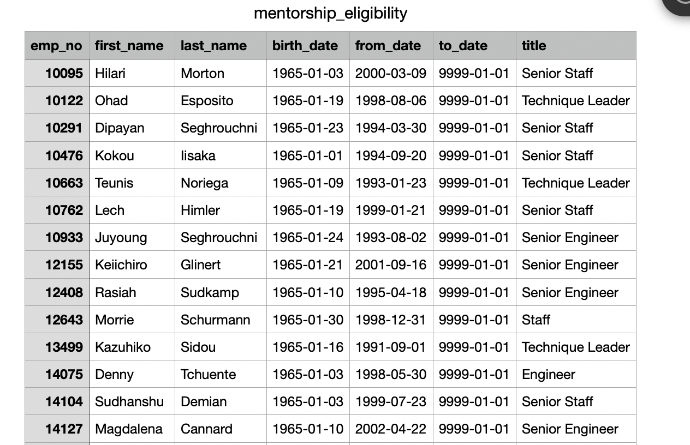
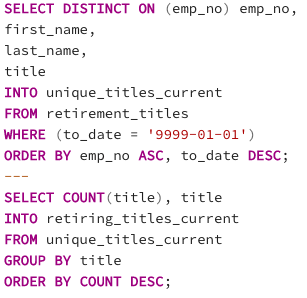
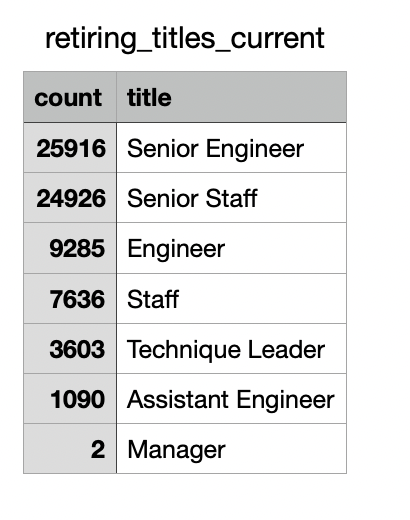

# Pewlett-Hackard-Analysis

## Overview
The purpose of this analysis is to determine the the number of retiring employees per title and identify employees who are eligible to participate in a mentorship program.

## Results

   - When we filter the data to show only the unique/most recent titles for each employee, there are a total of 90,398 employees who are eligible to retire.  
   - More senior roles, like Senior Engineer, have the highest amount of employees retiring.
   - More junior roles, like Assistant Engineer or Manager, have the lowest amount of employees retiring. 

   - Based on the mentorship program qualifications, there are a total of 1,549 current employees eligible.  
 
## Summary
   - As the "silver tsunami" begins to make an impact, there will be 90,398 roles that will need to be filled according to the table we created for retiring titles.
   - Since there are only 1,549 employees eligible for the mentorship program, there will not be nearly enough employees to mentor the next generation of Pewlett Hackard employees. 
   - However, our retiring titles table includes past employees so to take a look at how many current employees will be retiring, we would need to perform two additional queries pictured below:
   - 
   - From there, the total count of retiring employees dropped to 72,458. 
   - 
   
